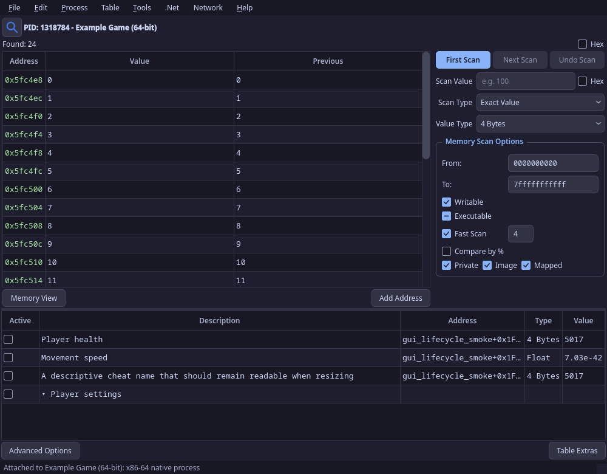

# Cheat Engine for Linux

[Compatibility progress and remaining work](docs/PROGRESS.md)

A native Linux memory scanner, debugger, disassembler, and trainer toolkit, a from-scratch C++20/Qt6 reimplementation of [Cheat Engine](https://github.com/cheat-engine/cheat-engine). It talks to the kernel directly (`process_vm_readv`/`writev`, `ptrace`, `/proc`, an optional kernel helper) instead of running the Windows build under Wine, and it reads and writes Cheat Engine's `.CT` tables so you can bring your existing ones.

> ⚠️ **Early and immature.** This is a young project (v0.9.5) under active development. Expect bugs, rough edges, and missing pieces, it does not match Cheat Engine's breadth or maturity yet. Keep backups, use it only on software you're allowed to analyze, and please [report issues](../../issues); they're what drive it forward.

> **Scope.** Built for single-player games, reverse engineering, and learning. It is *not* designed to defeat multiplayer anti-cheat (EAC, BattlEye, Vanguard, and similar), which run kernel components and will detect this class of tool. Use responsibly.

The GUI, CLI, and Lua share a Qt-free backend, with regression suites, ASan/UBSan coverage, and 11 offscreen GUI checks in CI.

Process compatibility is tracked [per target and feature](docs/COMPATIBILITY.md).
Architecture detection alone does not imply complete debugger or injection support.
Real Linux x32 fixtures now verify memory operations, 64-bit integer calls and
file offsets, library/pthread injection and exec recovery, using a normal LP64
engine. Debugger sessions, tracing and hardware/software watchpoints also pass
under the real x32 kernel ABI. [x32 coverage and remaining work](docs/COMPATIBILITY.md#linux-x32-execution).
Unreleased compatibility work verifies native x86-64, i386 and ARM64 memory
syscalls, debugger sessions, instruction tracing and hardware/software CodeFinder
watchpoints, including live ARM64 SVE/SME register recovery and deferred vector
lengths through real exec transitions. Stopped native integer calls verify private
stacks, exact return traps, signal/timeout recovery and context preservation.
Library/pthread injection now uses the shared native owner, with real libc
fixtures on x86-64, i386 and ARM64. An earlier compatibility snapshot cross-built
the complete ARM64 core and Qt GUI, with interactive debugger register edits,
CLI/Lua paths and application startup verified under an ARM64 kernel.
ARM64 instruction relocation preserves original addresses, live literal data
and branch targets, with actual execution checks on both 4 KiB and 64 KiB-page
kernels. Native executable-page writes now use a kernel cache-aware backend,
with exact verification and retained recovery after failures. Real 4 KiB and
64 KiB ARM64 guests verify execution, debugger-owned edits and same-file exec
recovery without changing RX permissions. Native ARM64 hook coordination, other
ISA/cache adapters and hardware validation remain pending.
ARM32 and Thumb general-register edits and software traps now pass under native
ARMv7 and ARM64 compat kernels, including register rollback and exact code
restoration. These backend primitives have [live evidence](docs/COMPATIBILITY.md#arm32-and-thumb-registers);
full ARM32 debugger sessions, injection and BE8 execution remain pending.
ARM32 VFP context recovery and compat TLS preservation also have
[live kernel checks](docs/COMPATIBILITY.md#arm32-vfp-and-context-recovery). Legacy
FPA restoration has a verified kernel limitation; full ARM32 injection stays pending.
Caller-owned ARM/Thumb scratch pages now execute actual mmap2, mprotect and
munmap with verified register, VFP and code restoration, including live Thumb
conditional state and interrupted-signal recovery. [Private memory checks](docs/COMPATIBILITY.md#arm32-private-memory-syscalls)
also verify file offsets above four GiB. General ARM32 allocation/injection adapters
and parked-syscall support remain pending.
For stopped user-code contexts, memory operations preserve every page needed by
a saved x86 or Thumb return instruction, including instructions crossing a page boundary. Short instructions
can still release an unused next page. [Return-code boundary evidence](docs/COMPATIBILITY.md#return-instructions-at-page-boundaries).
Interrupted x86 reads also retain the preceding syscall page needed by kernel
restart; completed calls can release that unused page. [Restart evidence](docs/COMPATIBILITY.md#syscall-restarts-at-page-boundaries).
Saved Auto Assembler and native x86 simple-hook undo preserve replacement code
after ordinary same-file exec. Completed undo copies and explicitly released
allocations cannot replay cleanup into reused storage; conflicting instruction
changes retain undo state for review. [Lifecycle evidence and remaining limits](docs/COMPATIBILITY.md#saved-operation-ownership).
Saved-image memory syscalls and native calls also verify address-space affinity
when a CLONE_VM process keeps old memory alive across same-file exec, including
identical replacement bytes. [Shared-memory checks and policy limits](docs/COMPATIBILITY.md#shared-address-space-affinity).
Retained native worker and pthread-handle cleanup checks the original address
space again before reclaiming storage or detaching an abandoned handle.
[Cleanup across exec and failed recovery](docs/COMPATIBILITY.md#retained-native-call-cleanup).
An exec performed by a called native function retires its saved context and
releases the replacement's stop, including signal resume and failed-detach retry.
[Callee exec checks](docs/COMPATIBILITY.md#native-callee-exec).
Worker-thread callees follow the kernel's replacement TID when they execute exec,
including retry after failed stop inspection. [Thread exec recovery](docs/COMPATIBILITY.md#native-nonleader-callee-exec).
Pthread-handle cleanup uses the same exec retirement and signal policy; retained
cleanup leases support explicit resume. [Cleanup callee checks](docs/COMPATIBILITY.md#native-pthread-cleanup-callees).
Independent handle release also preserves any cleanup stop and recovery until
restoration and detach finish. [Released lease checks](docs/COMPATIBILITY.md#independently-released-pthread-leases).
CodeFinder cleanup drains its queued hardware traps before detaching, preserving
application signals and stops. [Real-kernel teardown checks](docs/COMPATIBILITY.md#queued-hardware-trap-cleanup).
Standalone register and stack views use native thread registers and capture
stack bytes before resuming; register Apply preserves unedited live PC/SP.
Parked-call adapters and broader frontend/runtime validation remain pending.
Injected workers retain their code until actual thread exit; auto-assembler
rollback and disable preserve live worker storage for cleanup retry. Host-side
thread ownership is also verified against an i386 fixture in a Podman PID namespace.
Coverage also includes
busy Wine/WoW64 memory operations and native x86 Linux syscall-user-dispatch configurations. Full ARM64 application
support and broader architecture/runtime coverage remain in progress.

## New in 0.9.5

[Download v0.9.5](https://github.com/wleeaf/cheat-engine-linux/releases/tag/v0.9.5), or read the full [changelog](CHANGELOG.md).

- **Injection templates use the selected code.** Code, AOB, full-code, and pointer templates disassemble the injection site, preserve complete instructions, restore the exact original bytes, and use module-relative addresses or unique AOB signatures.
- **Consistent typed memory operations.** The GUI, CLI, and Lua share integer, pointer, floating-point, string, and byte-array handling. The CLI accepts unique process names and address expressions; scan results load incrementally and CSV export includes every match.
- **A more usable GUI.** Improved table widths, compact-window scrolling, light/dark contrast, live fonts and themes, toolbar overflow, process filtering, and settings behavior. Memory and register views show more useful information, and large form canvases scroll within the designer.
- **Deeper correctness fixes.** Scanning, snapshots, parsers, debugging, hooks, and Lua resource lifetimes have additional regression coverage.



The [visual review captures](artifacts/gui-review) include both themes, compact layouts, and larger fonts. Open `artifacts/gui-review/index.html` locally for the before/after gallery.

---

## Performance

The fastest memory scanner on Linux. In a same-machine, same-target benchmark, a first scan for a value is about **2x faster than Cheat Engine 7.7** (the official native Linux build) and **30 to 40x faster than scanmem, GameConqueror, and PINCE**, with larger margins on some scans (up to ~13x vs Cheat Engine and ~145x vs scanmem).\*

| First scan, 1 GB, exact int32 | Time | Throughput |
|---|---:|---:|
| This project | **0.085 s** | ~12 GB/s |
| Cheat Engine 7.7 (native Linux) | 0.156 s | ~6.6 GB/s |
| gdb `find` | 0.749 s | ~1.4 GB/s |
| scanmem 0.17 / GameConqueror | 2.924 s | ~0.34 GB/s |
| PINCE (libmemscan) | 3.480 s | ~0.29 GB/s |

\* "Up to" figures are best cases (rounded-float and byte-pattern scans vs Cheat Engine; reserved/untouched memory vs scanmem); the typical first-scan lead over CE 7.7 is ~2x. One machine (Intel i5-10500H, 12 threads); Cheat Engine timed excluding its GUI startup (in its favor). GameConqueror uses scanmem's engine; PINCE uses its own Zig backend (libmemscan), benchmarked here on exact-value scans. Full numbers, methodology, and reproduction steps: **[BENCHMARK.md](BENCHMARK.md)**.

---

## Features

- **Scanning** — every value type (int/float/double, string with iconv encodings, array-of-bytes with wildcards, binary, grouped, custom-Lua); all Cheat Engine comparisons (exact/bigger/smaller/between/unknown → changed/unchanged/increased/decreased/by-N/same-as-first); CE float rounding modes; region filters; alignment; multi-threaded, disk-backed scans for huge targets; undo; and pointer scanning with rescan and shardable distributed scans.
- **Editing** — typed reads/writes, directional freeze (locked / increase-only / decrease-only / …), grouped and batch edits, value hotkeys, and address-list records with pointer expressions (`module+offset`, `[[base]+off]`), grouping, colors, and dropdowns.
- **Debugger** — hardware (DR0-DR3) and software breakpoints, data (write/access) watchpoints, **conditional breakpoints** (sandboxed Lua over register state), enable/disable and hit counts, break-on-exceptions, single-stepping, break-and-trace, register/stack/thread views, and "find what accesses / writes this address".
- **Disassembler** — Capstone-backed, with jump arrows, cross-reference and branch-target resolution, `@plt`/`@got` import naming, DWARF source lines, and persistent user comments and labels.
- **Mono / Unity dissector** — an injected agent asks Mono for class and field layout (real offsets, types, statics), browsable in the GUI (**Tools ▸ Mono dissector**) or from Lua (`monoDissect()`, `findMonoFunction()`). Resident refresh, exact JIT method addresses, late assembly loading, garbage collection and normal exit now have [live host/container evidence](docs/COMPATIBILITY.md#mono-runtime-requests). Private embedded runtimes and safe errors after cleanup/library unload have [separate live checks](docs/COMPATIBILITY.md#embedded-mono-loading-and-lifetime). IL2CPP targets are detected.
- **Tables and scripting** — reads/writes CE `.CT` (XML), password-protected `.CETRAINER`, and native JSON; runs table Lua; generates standalone C trainers. A broad, CE-compatible Lua API (memory, scans, address list, disassembler, hotkeys, timers, hooks) that real cheat tables use.
- **Auto-assembler**: Cheat Engine compatible `alloc`/`globalalloc`, labels, symbols, `aobscanmodule`, data directives, `{$lua}` blocks, and site-specific code, AOB, full-code, and pointer injection templates.
- **Platform** — ceserver and GDB-remote clients for remote/cross-device debugging (with [verified CEServer TCP memory, breakpoint and reconnect behavior](docs/COMPATIBILITY.md#ceserver-target-identity-and-tcp-recovery) on native 32/64-bit targets), an X11 click-through overlay, a pitch-preserving speedhack (`LD_PRELOAD`), and an optional `CAP_SYS_ADMIN`-gated kernel helper for privileged memory access.
- **Diagnostics** — `CE_LOG=debug` (or per-subsystem, e.g. `CE_LOG=ptrace:trace`) turns on runtime logging with no rebuild.

## Building

```bash
sudo apt install build-essential cmake ninja-build qt6-base-dev libcapstone-dev \
                 zlib1g-dev libdw-dev libasound2-dev libsoundtouch-dev \
                 linux-headers-$(uname -r)

cmake -B build -DCMAKE_BUILD_TYPE=Release
cmake --build build -j1
```

Capstone and Keystone are fetched and compiled automatically when no system copy is found; that first build needs network access, and subsequent builds reuse the cached sources. Lua 5.3 and TinyXML2 are vendored. Prebuilt `.deb` and AppImage packages are attached to each [release](../../releases).

The build example and local CI default to one compiler job for limited machines.
Increase `-j` or set `CECORE_CI_JOBS` only when memory permits; run large validation
environments sequentially.

Optional kernel helper:

```bash
make -C /lib/modules/$(uname -r)/build M="$PWD/kernel" modules
sudo insmod kernel/cecore_kmod.ko    # /dev/cecore ; sudo rmmod cecore_kmod to unload
```

## Running

```bash
sudo LD_LIBRARY_PATH=build build/cheatengine        # GUI
LD_LIBRARY_PATH=build build/cescan --help      # CLI scanner
CE_SPEED=2.0 LD_PRELOAD=build/libspeedhack.so ./game # speedhack (pitch-preserving)
```

`ptrace`-based attach needs sufficient privileges or a permissive `ptrace_scope`. The `.deb` grants `cap_sys_ptrace` during installation so no root is required. Source builds and AppImages need suitable ptrace permissions; the GUI offers a permission prompt when a target is not readable.

## Command-line reference

```text
cescan list                          List all processes
cescan scan <pid> [options]          Scan process memory
cescan read <pid> <addr> [size]      Hex dump memory
cescan write <pid> <addr> <val>      Write a typed value
cescan freeze <pid> <addr> <val>     Keep a value fixed; --count N limits the cycles
cescan autoasm <pid> <script.aa>     Run a script; --disable-after N restores it
cescan disasm <pid> <addr> [count]   Disassemble instructions
cescan asm "call 0x401100" --origin 0x401000  Assemble at its execution address
cescan modules|regions <pid>         List loaded modules / memory regions
cescan signature <pid> <addr> [max]  Generate a unique AOB signature
cescan analyze <pid> <what>          Static RE: strings|statics|caves|functions|xrefs|asm
cescan il2cpp <global-metadata.dat>  Browse Unity IL2CPP metadata (offline)
cescan lua <script.lua>|-e <code>    Run Lua (same API as the GUI console)
cescan gdb <host> <port> <command>   Inspect a stopped GDB/QEMU target
```

Common scan options: `--type byte|i16|i32|i64|float|double|string|aob|…`, `--value`/`--value2`, `--compare exact|greater|less|between|changed|…`, `--rounding`, `--previous <dir>`, `--writable`, `--from`/`--to` (inclusive address expressions), `--byte-order auto|little|big`, and `--pointer-width 4|8`.

Scans default to the frontend's full address range. Narrowing From/To also filters
previous results before reading target memory, and includes values ending at To.

Targets accept either a PID or a unique process name. Ambiguous names report the matching PIDs. Host address arguments accept the same expressions as the GUI, including `module+0xoffset`, symbols, and `[pointer]+0xoffset`.

GDB targets use an endpoint and numeric guest addresses. The shared adapter reads
the stub's XML register layout and instruction architecture. Commands include
`info`, `read <address> <size>`, `write <address> <hex-bytes>`,
`reg <name> [hex-bytes]`, `disasm <address> <count>`, and
`scan <address> <size> "AOB pattern"`. Add `--type i32|float|double|pointer|string|unicode` for a typed search, for example `scan 0x1000 4 305419896 --type i32 --be`. Register edits use bytes in the target's
register order. Use `--le` or `--be` when the stub cannot describe data byte order,
and `--width 4|8` for a known program pointer width. Each command detaches when
finished. In the GUI, choose **File > Connect to GDB / QEMU...**; the Memory
Viewer's **Debug > Registers** editor uses the target's XML register widths.
Register access also supports stubs that expose only whole-register packets;
edits preserve fresh values of unrelated registers. Registers omitted from that
bank remain unavailable when the stub lacks individual-register support.
Lua provides `connectToGdb`, `getGdbRegisterInfo`, `readGdbRegister`,
`writeGdbRegister`, and `disconnectProcess`. See [Lua endpoint options](docs/SCRIPTING.md#gdb--qemu-targets).
Numeric and Unicode scans follow the selected program's data byte order, and pointer scans follow its pointer width. Saved samples retain that format for result display. Lua MemScan also accepts explicit format options and exposes captured values with `getValue`; see [scan data formats](docs/SCRIPTING.md#memory-scans-and-captured-values).
The GUI's Memory Scan Options also provide **Data order** and **Pointer size** for independently encoded data. Results transferred to the address list retain their format for reads, edits, freezing and table saves. A record's context menu can select its own data order and pointer size.

JSON tables preserve exact integer addresses and escaped Unicode text. Malformed JSON records are rejected before replacing the current table, and failed GUI saves preserve the previous file. [Persistence checks](docs/COMPATIBILITY.md#exact-json-values-and-deterministic-gui-saving-checks).

All scans preserve the numeric types that matched at each address through later scans, including float/double comparisons and fields near unreadable memory. You can narrow to a surviving specific type. Lua exposes those types with `getValueTypes` and can decode a selected candidate through `getValue`.
GUI, CLI and Lua share strict All-value parsing for decimal, scientific and hexadecimal input, preserving fractional integer bounds and exact 64-bit values. Floating scans preserve the original input for rounded, truncated and tolerance comparisons, including scientific notation. Lua supports explicit `rounding`, `tolerance` and numeric Between upper bounds through `value2`; see [scan options](docs/SCRIPTING.md#memory-scans-and-captured-values).
Guest process/MMU mapping and full guest debugger integration remain pending;
see [compatibility coverage](docs/COMPATIBILITY.md).

```bash
cescan read game 'game+0x120' --type u64
cescan write game '[game+0x120]+0x8' '2,5' --type float --verify
cescan write game 0x123400 '世界' --type unicode --be --terminate
cescan freeze game 0x123400 '90 48 8B' --type aob --count 20 --interval 50
cescan autoasm game patch.aa --disable-after 10
```

Typed reads, writes, and freezes support signed and unsigned integer aliases, target-width pointers, float/double, UTF-8, UTF-16 (`unicode`), code pages (`--encoding CP1252`), and concrete byte arrays. Integer overflow and malformed input produce errors before writing. `--terminate` appends the encoding's zero terminator to a string; raw writes omit it by default. Byte arrays accept spaces, commas, tabs, and line breaks. `write --verify` returns a failing exit status if the value changes, and `--find-writer` can investigate that change. `autoasm --disable-after` restores saved bytes and releases allocations after the delay or Ctrl-C.

The GUI loads more scan rows as you scroll and exports every stored match with **Save current scan results**. CSV values are quoted correctly; export can be canceled without replacing the destination file. UTF-8 address-list values display their full text, edits retain their new byte length, and shorter strings receive a zero terminator within their previous length. Clearing a string writes a zero terminator. Floating-point text preserves the stored value when written back.

## Scripting & reverse engineering

The Lua API (GUI console or `cescan lua`) also drives the static analysis stack:
IL2CPP (Unity) class/field/method resolution, DWARF struct typing, PE
export/import parsing, AOB signature generation, cross-references, and range
disassembly. See **[docs/SCRIPTING.md](docs/SCRIPTING.md)** for the reference and
runnable scripts in **[examples/](examples)**.

## Auto-assembler example

In the Memory Viewer, select the instructions to inject at and open **Tools > Auto Assemble**. Choose an injection template from **Templates**, or press **Ctrl+I** for code injection. The generated script uses that site's instructions, overwrite length, original bytes, and module context. AOB templates require a unique signature; ambiguous sites report an error.

The example below assumes a unique six-byte instruction in `game.bin`. Use the generated template for your actual target, then edit the code in `newmem`.

```asm
[ENABLE]
aobscanmodule(INJECT, game.bin, 8B 83 20 01 00 00)
assert(INJECT, 8B 83 20 01 00 00)
alloc(newmem, $1000, INJECT)
label(return)
newmem:
  mov eax, [rbx+0x120]   // original six-byte instruction
  mov eax, 999
  jmp return
INJECT:
  jmp near newmem       // five-byte jump
  nop                  // covers the remaining original byte
return:
registersymbol(INJECT)

[DISABLE]
INJECT:
  db 8B 83 20 01 00 00
unregistersymbol(INJECT)
dealloc(newmem)
```

## Development

```bash
./build/cecore_test              # regression suite
./build/cecore_deep_test         # deeper correctness and injection regressions
python3 test/table_json_gate.py build --report build/compatibility-evidence/table-json.json
python3 test/gui_injection_gate.py build --report build/compatibility-evidence/gui-injection.json # records/editors, live x86-64 and i386
python3 test/autoasm_module_gate.py build --report build/compatibility-evidence/autoasm-modules.json # module refresh, exec and symbol ownership
tools/ci-check.sh --config       # validate full and no-Qt configurations
tools/ci-check.sh # build and test both configurations before pushing, one job by default
./build/gui_lifecycle_smoke --screenshots /tmp/ce-gui-review # repeatable GUI captures
```

```text
analysis/  code analysis, managed-runtime + Mono dissector       gui/       Qt6 app, disassembler, overlay
arch/      Capstone disassembler / Keystone assembler            kernel/    optional privileged helper
cli/       cescan command-line tool                              platform/  process API, ptrace, injector, ceserver
core/      types, auto-assembler, expressions, tables, hooks     plugins/   speedhack, mono agent, audio
debug/     breakpoints, debug session, tracing, GDB remote       scanner/   memory + pointer scanners
scripting/ Lua engine and bindings                               symbols/   ELF/DWARF + kernel symbols
```

## Security

- **Untrusted input.** ELF/DWARF parsers, table loaders, the auto-assembler, and Lua breakpoint conditions treat input as untrusted: reads are bounds-checked, `.CETRAINER` loads are size-capped, and conditions run in a sandboxed, execution-bounded Lua state. Only open `.CT`/`.CETRAINER` files you trust, a table's Lua/AA can manipulate the target, and running it prompts for confirmation. `shellExecute` and the unsafe file-write functions are default-denied.
- **Kernel helper.** `kernel/cecore_kmod.c` is optional and exposes only explicit `CAP_SYS_ADMIN`-gated ioctls through `/dev/cecore`. It does not hide modules, files, or sockets.

## License

MIT. Inspired by [Cheat Engine](https://github.com/cheat-engine/cheat-engine) by Dark Byte; review upstream licensing before redistributing derived assets or compatibility data.
